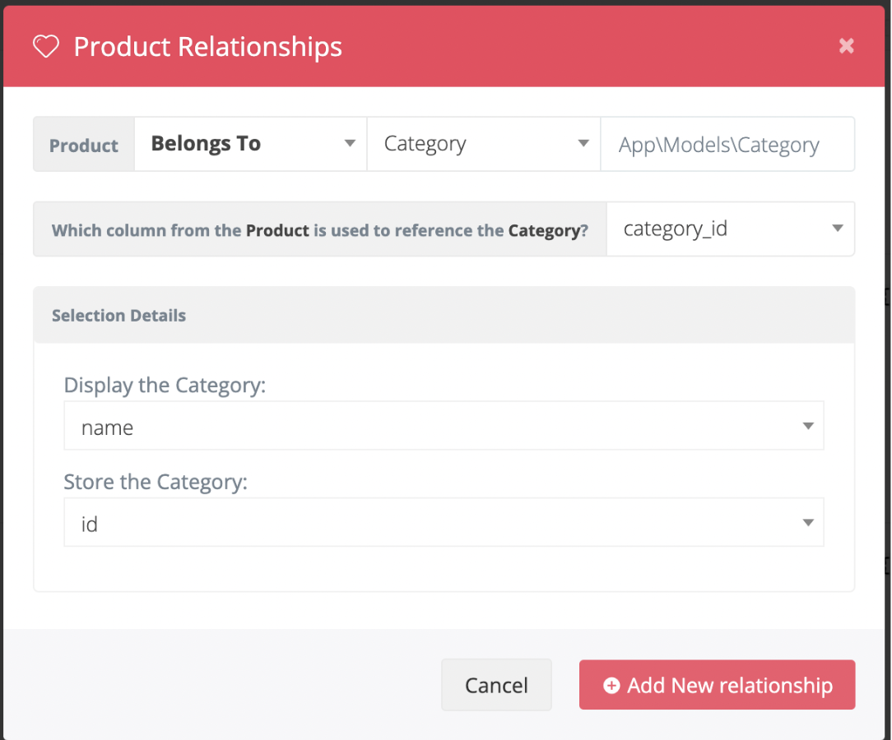

Практическая работа

# Цели практической работы

*   научиться интегрировать админ-панель в проект;
*   разобраться в настройке CRUD-методов для сущности в Voyager

# Что нужно сделать

В этой практической работе вы создадите панель администратора склада интернет-магазина.

1.  Создайте новый проект Laravel или откройте уже существующий.
2.  Создайте новую ветку вашего репозитория от корневой (main или master).
3.  Создайте сущность Category (модель, миграцию и контроллер) командой php artisan make:model Category -m
4.  Опишите миграцию для таблицы categories c типами полей

```
          $table->id();
          $table->string('name');
          $table->timestamps();
```
5.  Создайте сущность Product (модель, миграцию и контроллер) командой php artisan make:model Product -m
6.  Опишите миграцию для таблицы products c типами полей

```
          $table->string('sku');
          $table->id();
          $table->string('sku');
          $table->string('name');
          $table->foreignId('category_id')->constrained();
```
7.  Выполните миграцию командой php artisan migrate.
8.  Установите voyager командой composer require tcg/voyager
9.  Выполните установку voyager внутри вашего приложения командой 
```
php artisan voyager:install
```
10.  Создайте администратора вашего приложения
```
php artisan voyager:admin [your@email.com](mailto:your@email.com)
```
11.  Войдите в панель администратора, перейдите во вкладку tools/bread и добавьте возможность редактирования сущностей category и product
12.  После создания CRUD для сущности product перейдите в эту сущность и нажмите на кнопку Create A Relationship
13.  Настройте связь следующим образом

14.  Сохраните
15.  Создайте категорию и далее создайте тестовый товар, прикрепленный к данной категории
16.  Создайте в своем проекте директорию App/Admin/Widgets и добавьте туда два виджета ProductsWidget и CategoriesWidget
17.  Реализуйте в этих виджетах счетчики количество товаров и категорий
18.  Добавьте виджеты в конфигурационный файл voyager.php
```
  'widgets' => [

            \App\Admin\Widgets\ProductsWidget::class,

            \App\Admin\Widgets\CategoriesWidget::class,

        ],
```


# Критерии оценки работы

**Принято:** 

*   выполнены все пункты работы;
*   в работе используются указанные инструменты, соблюдены условия;
*   код корректно отформатирован по стандартам программирования на PHP;
*   код запускается, выводит различные данные на экран, не вызывает ошибок.

**На доработку:**

*   выполнены не все пункты работы;
*   работа выполнена с ошибками.

# Как отправить работу на проверку

1.  Отправьте коммит с кодом в ветку master в вашем репозитории. 
2.  Отправьте URL вашего репозитория через форму ниже.
3.  Сделайте скриншоты следующих частей вашего приложения
4.  Страницы - дашборда администратора с виджетами
5.  Левого меню панели администратора с новыми пунктами (категории и продукты)
6.  Раздел продуктов
7.  Страницу создания продукта
8.  Вид одного продукта
9.  Страницу редактирования продукта
10.  Раздел категорий
